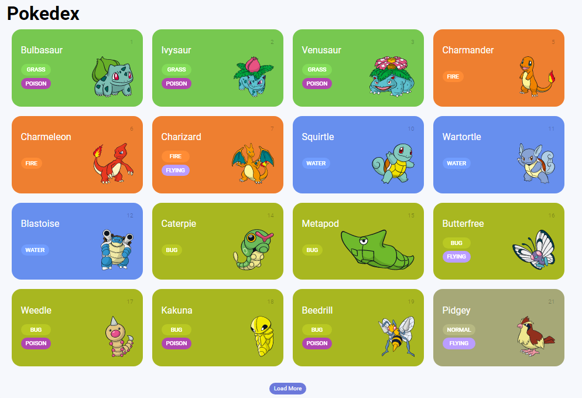

# Pokedex
## Projeto de Pokedex, desenvolvido no Bootcamp NTT Data Diversidade Tech pela a Digital Innovattion One(DIO).

O objetivo do projeto era criar uma Pokedex, até então bem básica, porém com o andamento do projeto pude ver que é algo um tanto quanto complexo.
Treinei como principal o conceito de mobile first e o consumo da API PokeAPI, tocando em alguns pontos de requisições HTTP, conheci algumas funções como a "Map",
múltiplas requisições em paralelo, paginação, entre outros.
  
As tecnologias usadas durante o desenvolvimento foram:

- HTML;
- CSS;
- Javascript;
- API da Pokedex: https://pokeapi.co/;

Aplicação em funcionamento:

GitHub:
https://github.com/PhMoraiis/Pokedex

## Imagem do Projeto

